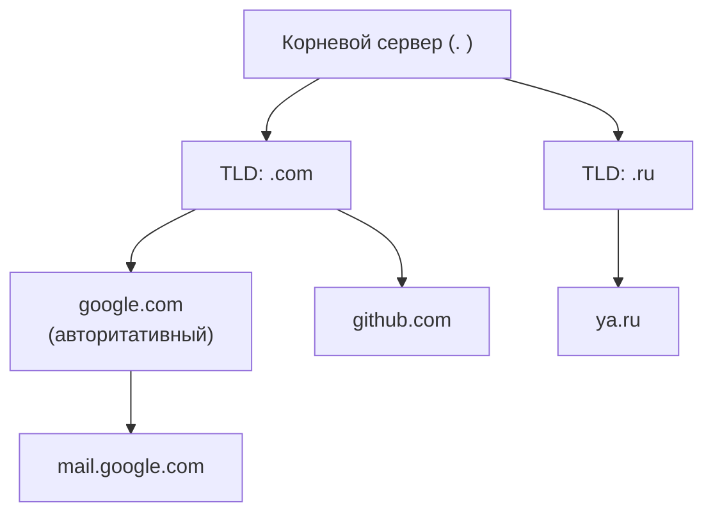
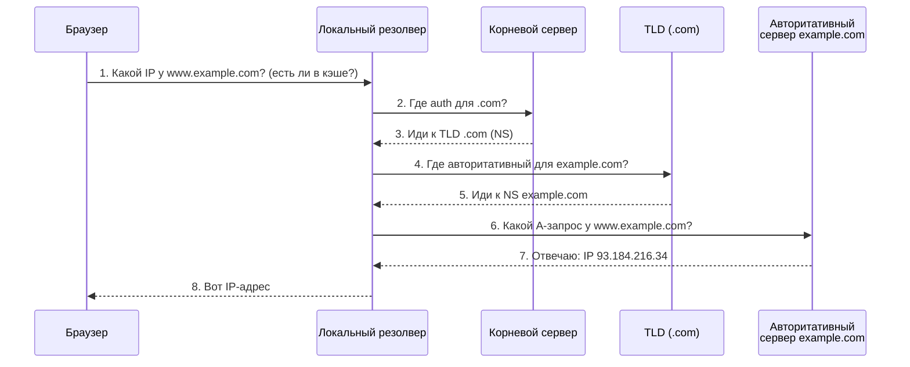
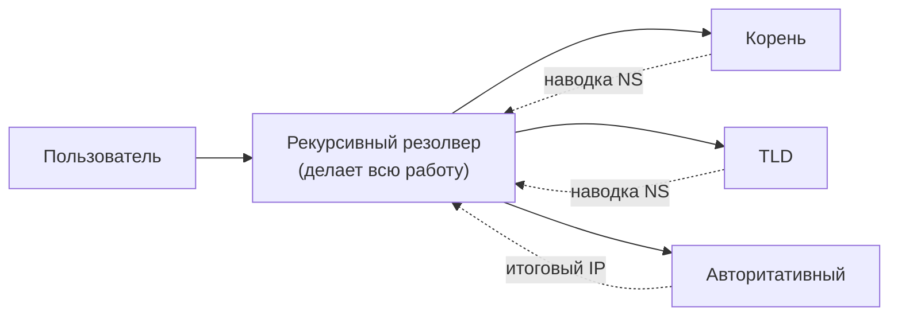
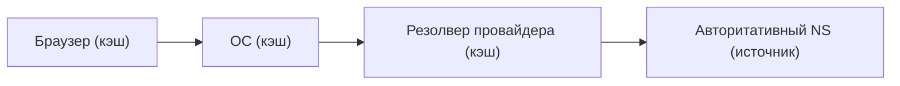
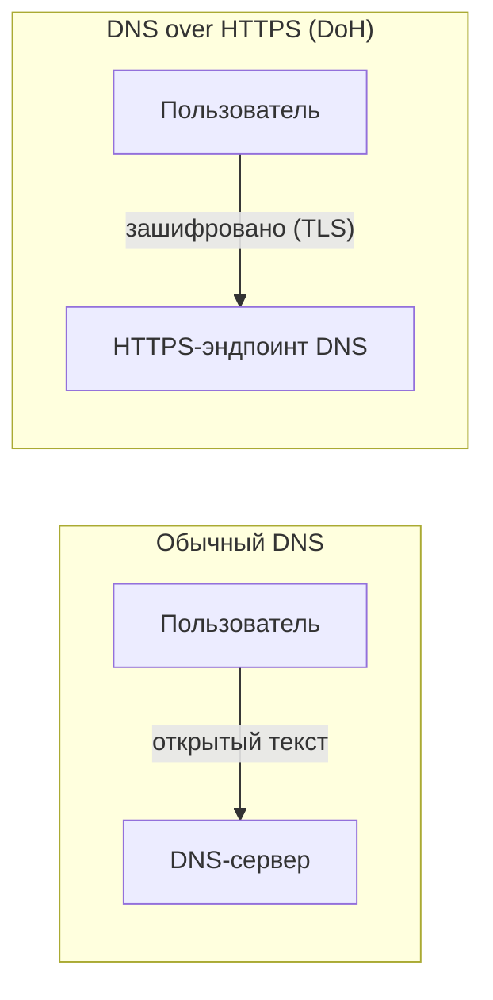

# Разделы 7–8 — DNS: телефонная книга интернета

## В этом разделе

1. [Зачем нужен DNS](#1-зачем-нужен-dns)
2. [Иерархическая структура DNS](#2-иерархическая-структура-dns)
3. [Типы DNS-записей](#3-типы-dns-записей)
4. [Как работает DNS-запрос](#4-как-работает-dns-запрос)
5. [Рекурсивный и итеративный резолвер](#5-рекурсивный-и-итеративный-резолвер)
6. [Кэширование и TTL](#6-кэширование-и-ttl)
7. [Инструменты: dig и nslookup](#7-инструменты-dig-и-nslookup)
8. [Безопасность DNS: DoH и DoT](#8-безопасность-dns-doh-и-dot)
9. [Практика: разбор типичных ошибок](#9-практика-разбор-типичных-ошибок)
10. [Упражнения](#10-упражнения)

---

## 1. Зачем нужен DNS

Люди запоминают **имена** (google.com), а компьютеры работают с **числами** (IP-адресами). **DNS** (Domain Name System) — распределённый справочник, который переводит доменные имена в IP-адреса.

Попробуйте ввести IP вместо домена:
- `https://142.250.74.4` — откроется, но это неудобно и «нечитаемо».
- А домен `google.com` красив и понятен.

DNS — как **телефонная книга**: по имени находишь номер (IP).

> ⚠️ Распространённое заблуждение: «после ввода адреса браузер идёт на сервер, а DNS — что-то необязательное». На самом деле браузер **сначала** делает DNS-запрос, чтобы узнать IP, и лишь потом соединяется по TCP/IP.

---

## 2. Иерархическая структура DNS

Доменные имена — иерархические, читаются **справа налево**:

```
mail.google.com
     └────┘ └─┘ └─┘
        │    │   └── субдомен (3-го уровня)
        │    └────── домен 2-го уровня (google)
        └─────────── домен верхнего уровня / TLD (com)
```

Уровни:

| Уровень | Пример | Кто управляет |
|---------|--------|---------------|
| Корневой (root) | `.` | ICANN, корневые серверы |
| TLD (верхний) | `.com`, `.ru`, `.org`, `.net` | Реестры TLD |
| Домен 2-го уровня | `google.com`, `ya.ru` | Владелец домена |
| Субдомен | `mail.google.com`, `blog.ya.ru` | Владелец домена |



Каждый уровень «отвечает» за своих «детей», используя **NS-записи** (укажем ниже). Это распределённая, отказоустойчивая система — нет единой точки отказа.

---

## 3. Типы DNS-записей

В зоне домена хранятся **resource records** — записи разных типов:

| Тип | Расшифровка | Назначение |
|-----|-------------|------------|
| **A** | Address | IPv4-адрес домена |
| **AAAA** | IPv6 Address | IPv6-адрес домена |
| **CNAME** | Canonical Name | Алиас (псевдоним) на другой домен |
| **MX** | Mail Exchange | Почтовый сервер домена |
| **NS** | Name Server | Авторитативный DNS-сервер зоны |
| **TXT** | Text | Произвольный текст (SPF, DKIM, проверки) |
| **PTR** | Pointer | Обратная запись: IP → домен |
| **SOA** | Start of Authority | Служебная информация о зоне |

### Примеры

**A-запись** (домен → IPv4):
```
example.com.  300  IN  A  93.184.216.34
```

**CNAME** (алиас домена на другой):
```
www.example.com.  300  IN  CNAME  example.com.
```

**MX** (почтовый сервер со значением приоритета):
```
example.com.  3600  IN  MX  10 mail.example.com.
```

**TXT** (например, подтверждение владения или SPF для почты):
```
example.com.  3600  IN  TXT  "v=spf1 include:_spf.google.com ~all"
```

**AAAA** (IPv6):
```
example.com.  300  IN  AAAA  2606:2800:220:1:248:1893:25c8:1946
```

---

## 4. Как работает DNS-запрос

Разберём полный путь, когда вы вводите `www.example.com`.



Шаги:
1. Браузер спрашивает у **локального резолвера** (обычно это DNS вашего провайдера или роутера).
2–7. Резолвер, если в кэше нет ответа, идёт **сверху вниз**: корень → TLD → авторитативный сервер домена.
8. Ответ возвращается в браузер, который затем устанавливает соединение по IP.

---

## 5. Рекурсивный и итеративный резолвер

- **Рекурсивный резолвер** — это ваш «агент». Он сам выполняет всю цепочку запросов и возвращает итоговый ответ. Пример: DNS провайдера, 8.8.8.8 (Google).
- **Итеративный запрос** — сервер даёт «наводку» (адрес следующего сервера), а спрашивающий сам обращается дальше.

На практике у пользователя — **рекурсивный** резолвер, который внутри делает итеративные запросы к корню/TLD/авторитативным.



---

## 6. Кэширование и TTL

DNS-запросы кэшируются на разных уровнях, чтобы не запрашивать каждый раз всю цепочку.

**TTL** (Time To Live) — время жизни записи в кэше (в секундах). Чем меньше TTL, тем быстрее обновления, но больше нагрузка. Обычно 60–86400.

Уровни кэша:
1. **Браузер** (встроенный DNS-кэш).
2. **ОС** (системный кэш).
3. **Рекурсивный резолвер** (провайдер/публичный).
4. **Авторитативный сервер** (источник истины).



> ⚠️ **Важно для разработчика:** если вы изменили DNS-запись, изменения «расползаются» по интернету **не мгновенно**. Из-за кэшей с длинным TTL старый IP может оставаться в ходу от минут до суток. Для быстрого применения изменений удобно временно снизить TTL перед сменой.

---

## 7. Инструменты: dig и nslookup

### nslookup (Windows/Linux/macOS)

```bash
nslookup google.com          # IP-адрес
nslookup -type=MX gmail.com  # почтовые серверы
nslookup -type=TXT example.com
```

### dig (Linux/macOS, расширенный)

```bash
dig google.com                    # подробный ответ
dig +short google.com             # только IP
dig example.com A                 # конкретный тип
dig google.com MX                 # MX-записи
dig @8.8.8.8 google.com           # запрос к конкретному DNS-серверу
dig -x 8.8.8.8                    # обратный (PTR): IP → домен
```

Пример вывода `dig`:

```
;; ANSWER SECTION:
google.com.     158  IN  A  142.250.74.4
```

- Число — **TTL** (осталось секунд в кэше).
- `IN` — класс (Internet).
- `A` — тип записи.
- `142.250.74.4` — значение.

---

## 8. Безопасность DNS: DoH и DoT

Обычные DNS-запросы передаются **в открытом виде** (UDP, без шифрования). Злоумышленник на пути может перехватить и подменить ответ (**DNS-spoofing**).

Решения:
- **DNS over HTTPS (DoH)** — DNS-запросы поверх HTTPS (шифруются TLS, скрыты от провайдера). Порт 443.
- **DNS over TLS (DoT)** — DNS поверх TLS. Порт 853.



DoH/DoT защищают от подмены и цензуры. Многие системы и браузеры (Firefox, Chrome, iOS) поддерживают DoH.

---

## 9. Практика: разбор типичных ошибок

| Симптом | Причина | Решение |
|---------|---------|---------|
| «Сайт не открывается, но у других открывается» | Кэш DNS на вашем устройстве устарел | `ipconfig /flushdns` (Win) или сброс/resolvectl |
| URL без `www` не работает, а с `www` — работает | Нет записи для корневого домена | Добавить A-запись/алиас для `example.com` |
| Изменили DNS, но всё ещё старый IP | Длинный TTL в кэше | Дождаться или временно снизить TTL |
| Почта не приходит | Нет/неверная MX-запись | Проверить `dig MX` |
| Сайт открывается у «себя», но не везде | Зона/NS настроены неверно или ещё не распространились | Проверить NS, подождать |

Команды, которые помогают диагностировать:

```bash
dig example.com NS      # авторитативные серверы домена
dig @a.iana-servers.net example.com A    # запрос к конкретному NS
host example.com        # краткий вывод IP
```

---

## 10. Упражнения

1. Выполните `nslookup ya.ru` — найдите IP.
2. `dig google.com MX` — какие почтовые серверы у Google? Какой приоритет?
3. `dig +short example.com A` — сравните с полным выводом `dig`.
4. Обратный запрос: `dig -x 8.8.8.8` — что вернётся?
5. Объясните разницу между A, AAAA и CNAME записями своими словами.
6. Нарисуйте Mermaid-диаграмму кэширования DNS (браузер→ОС→провайдер→авторитативный).
7. Ответьте: почему люди запоминают `google.com`, а не `142.250.74.4`?

---

**Дальше:** [Раздел 9–10 — HTTP →](http.md)
