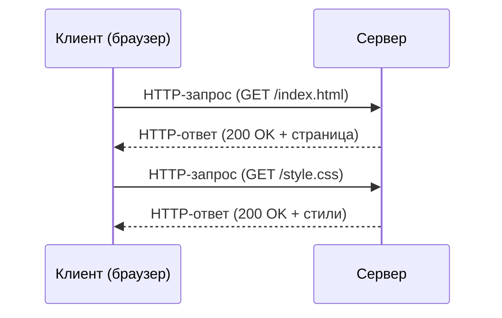
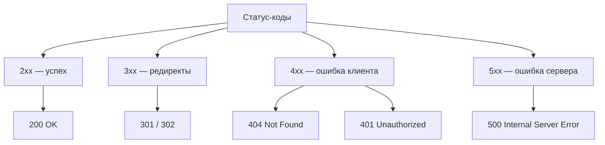
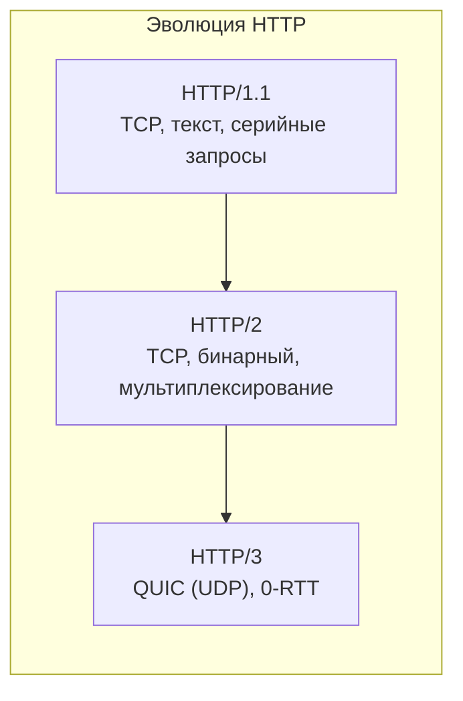

# Разделы 9–10 — HTTP: протокол веба и заголовки

## В этом разделе

1. [Что такое HTTP](#1-что-такое-http)
2. [Модель запрос–ответ](#2-модель-запросответ)
3. [Структура HTTP-запроса](#3-структура-http-запроса)
4. [Методы HTTP](#4-методы-http)
5. [Структура HTTP-ответа](#5-структура-http-ответа)
6. [Статус-коды](#6-статус-коды)
7. [Заголовки запроса](#7-заголовки-запроса)
8. [Заголовки ответа](#8-заголовки-ответа)
9. [HTTP/1.1, HTTP/2, HTTP/3](#9-http11-http2-http3)
10. [Практика: разбор типичных ошибок](#10-практика-разбор-типичных-ошибок)
11. [Упражнения](#11-упражнения)

---

## 1. Что такое HTTP

**HTTP** (HyperText Transfer Protocol) — прикладной протокол передачи данных в вебе. Он определяет, как клиент (браузер) *запрашивает* ресурс и как сервер *отвечает*.

- Работает поверх **TCP** (обычно порт 80 при HTTP, 443 при HTTPS).
- Основан на сообщениях (запрос/ответ).
- **Не сохраняет состояние** (stateless): каждый запрос сервер «не помнит» клиента, если только не используют cookies/токены (поэтому добавлены сессии).

> ⚠️ **Stateless** важно понимать: HTTP сам по себе не помнит вас между запросами. Память (авторизация, корзина) реализуется через **cookies, сессии, токены** поверх HTTP — об этом в [следующем разделе](https.md).

---

## 2. Модель запрос–ответ

Взаимодействие строго клиент-серверное:



Каждое действие — это **один запрос и один ответ**. Если на странице 20 картинок — будет 20 запросов.

---

## 3. Структура HTTP-запроса

HTTP-запрос состоит из **стартовой строки**, **заголовков** и (опционально) **тела**.

```
GET /index.html HTTP/1.1
Host: example.com
User-Agent: Mozilla/5.0 ...
Accept: text/html

(тело для POST и т.п.)
```

Разбор:

| Часть | Пример | Что это |
|-------|--------|---------|
| Метод | `GET` | Действие |
| Путь | `/index.html` | Какой ресурс |
| Версия | `HTTP/1.1` | Версия протокола |
| Заголовки | `Host: ...` | Метаданные запроса |
| Тело | (после пустой строки) | Данные запроса (POST) |

> ⚠️ Заголовки заканчиваются **пустой строкой** перед телом. Тело отделяется от заголовков обязательно.

---

## 4. Методы HTTP

Метод описывает, **какое действие** выполнить над ресурсом.

| Метод | Назначение | Есть тело? | Идемпотентен? |
|-------|-----------|-----------|---------------|
| **GET** | Получить ресурс | Нет | Да |
| **POST** | Создать/отправить данные на сервер | Да | Нет |
| **PUT** | Полностью заменить ресурс | Да | Да |
| **PATCH** | Частично изменить ресурс | Да | Нет |
| **DELETE** | Удалить ресурс | — | Да |
| **HEAD** | Как GET, но без тела (только заголовки) | Нет | Да |
| **OPTIONS** | Узнать поддерживаемые методы/параметры | — | Да |

> **Идемпотентность** — повторный запрос того же типа даёт тот же результат (без побочных изменений). GET безопасен, POST — нет.

**Семантика важна:**
- **GET** — читать. Не должен менять данные.
- **POST** — создавать/обрабатывать (форма, авторизация).
- **PUT/PATCH/DELETE** — изменять/удалять.

> ⚠️ Частая ошибка новичков: использовать POST или GET «как попало». Машины и API полагаются на семантику методов.

---

## 5. Структура HTTP-ответа

Ответ похож на запрос, но вместо стартовой строки — **версия, статус-код и фраза**.

```
HTTP/1.1 200 OK
Content-Type: text/html; charset=UTF-8
Cache-Control: max-age=3600

(тело ответа — например, HTML)
```

---

## 6. Статус-коды

Трёхзначный код + текстовая причина.

| Диапазон | Семейство | Примеры |
|----------|-----------|---------|
| **1xx** | Информационные | 100 Continue, 101 Switching Protocols |
| **2xx** | Успешно | **200 OK**, 201 Created, 204 No Content |
| **3xx** | Перенаправление | **301** Moved Permanently, **302** Found, 304 Not Modified |
| **4xx** | Ошибка клиента | **400** Bad Request, **401** Unauthorized, **403** Forbidden, **404** Not Found, 429 Too Many Requests |
| **5xx** | Ошибка сервера | **500** Internal Server Error, **502** Bad Gateway, **503** Service Unavailable, **504** Gateway Timeout |



**Ключевые коды, которые важно знать:**
- **200 OK** — успех.
- **201 Created** — ресурс создан (POST).
- **301** — постоянный редирект (переехал навсегда).
- **302** — временный редирект.
- **304 Not Modified** — не изменилось, использовать кэш.
- **400** — неверный запрос.
- **401** — нужна авторизация.
- **403** — доступ запрещён (авторизация не помогла).
- **404** — ресурс не найден.
- **500** — ошибка на сервере.
- **503** — сервер временно недоступен (перегрузка/обслуживание).

---

## 7. Заголовки запроса

Заголовки передают метаданные запроса.

| Заголовок | Назначение | Пример |
|-----------|------------|--------|
| `Host` | Какой виртуальный хост (обязателен в HTTP/1.1) | `Host: example.com` |
| `User-Agent` | Сведения о клиенте (браузер/ОС) | `User-Agent: Mozilla/5.0 ...` |
| `Accept` | Какие типы ответа принимает клиент | `Accept: text/html, application/json` |
| `Accept-Language` | Предпочитаемый язык | `Accept-Language: ru, en` |
| `Authorization` | Данные авторизации (Bearer-токен / Basic) | `Authorization: Bearer abc123` |
| `Cookie` | Отправка cookies клиента | `Cookie: session=xyz` (см. след. раздел) |
| `Content-Type` | Тип тела запроса (POST) | `Content-Type: application/json` |
| `Referer` | Откуда пришли | `Referer: https://google.com` |

Пример отправки данных JSON:

```
POST /api/users HTTP/1.1
Host: example.com
Content-Type: application/json

{"name": "Иван", "age": 30}
```

---

## 8. Заголовки ответа

| Заголовок | Назначение | Пример |
|-----------|------------|--------|
| `Content-Type` | Тип содержимого тела | `Content-Type: text/html; charset=utf-8` |
| `Content-Length` | Размер тела в байтах | `Content-Length: 1200` |
| `Cache-Control` | Политика кэширования | `Cache-Control: max-age=3600` |
| `Set-Cookie` | Установить cookie у клиента | `Set-Cookie: session=abc; HttpOnly` |
| `Location` | Адрес редиректа (3xx) | `Location: https://example.com/new` |
| `ETag` | Версия ресурса для кэша/валидации | `ETag: "abc123"` |
| `Access-Control-Allow-Origin` | Разрешение CORS | `Access-Control-Allow-Origin: *` |
| `Server` | Информация о сервере | `Server: nginx` |

**Content-Type — MIME-типы:**
- `text/html`, `text/css`, `text/plain`
- `application/json`
- `application/javascript`
- `image/png`, `image/jpeg`
- `multipart/form-data` (для форм с файлами)

---

## 9. HTTP/1.1, HTTP/2, HTTP/3

Протокол эволюционирует для скорости и надёжности.

### HTTP/1.1 (1997)
- Одно соединение = один запрос за раз (по умолчанию). Через keep-alive можно переиспользовать, но **последовательно**.
- **Head-of-line blocking**: медленный запрос блокирует следующие.
- Заголовки передаются в открытом виде (text format).

### HTTP/2 (2015)
- **Мультиплексирование**: один TCP-канал = много запросов параллельно.
- **Бинарный** формат (быстрее разбор).
- **Сжатие заголовков** (HPACK).
- **Server Push** (сервер может заранее прислать ресурсы) — позже почти отказались.
- HTTPS обычно обязателен.

### HTTP/3 (2022+)
- Работает поверх **QUIC** (на базе UDP) вместо TCP.
- Устраняет head-of-line blocking на уровне TCP.
- **Быстрее** установка соединения (0-RTT).
- Лучшее поведение при потере пакетов.



> ⚠️ Практический вывод: HTTP/2 почти не потребует действий от разработчика (браузеры и серверы договариваются сами), но понимание помогает при отладке и оптимизации.

---

## 10. Практика: разбор типичных ошибок

| Ошибка/ситуация | Пояснение |
|------------------|-----------|
| «Получил 404 — значит сервер упал» | Нет, 404 — клиентская ошибка: ресурс (URL) не найден |
| «500 — это я (клиент) виноват» | Нет, 500+ — ошибка на стороне сервера |
| «Редирект 404 → 301...» | Разные вещи: 3xx — перенаправление, 4xx — ошибка |
| Использовал GET для формы, которая меняет данные | GET не должен менять состояние — используйте POST |
| Неправильный `Content-Type` для JSON | Сервер не сможет распарсить тело |
| Думают, что HTTP сам «помнит» клиента | HTTP stateless; память дают cookies/токены |

### Как посмотреть реальный HTTP (DevTools)

1. Откройте DevTools (F12) → вкладка **Network**.
2. Обновите страницу.
3. Клик на запрос → вкладки **Headers / Response / Preview**.

Там видны все методы, статусы, заголовки и тело — лучший способ «пощупать» HTTP.

---

## 11. Упражнения

1. Через DevTools откройте главную страницу любого сайта и найдите: `GET`-запросы, статус 200, `Content-Type`, размеры.
2. Определите метод и код ответа, когда: открываете страницу; отправляете форму логина; получаете «страница не найдена».
3. Какие методы вы бы использовали для CRUD (create, read, update, delete)?
4. Приведите пример, когда сервер отвечает `301` и что сделает браузер.
5. Нарисуйте Mermaid-диаграмму «пользователь открывает страницу», указав DNS → TCP → HTTP шаги.

---

**Дальше:** [Раздел 11–12 — Cookies, кэширование и HTTPS →](https.md)
