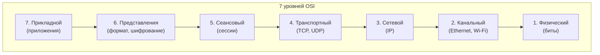
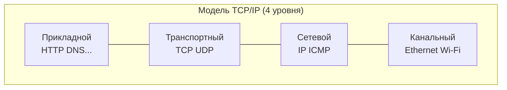
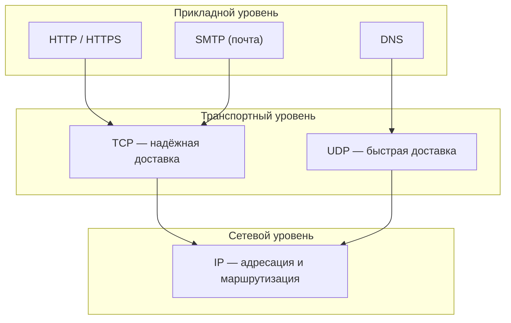

# Разделы 1–2 — Введение и модели сетей

## В этом разделе

1. [Зачем разработчику знать протоколы](#1-зачем-разработчику-знать-протоколы)
2. [Что такое сеть и протокол](#2-что-такое-сеть-и-протокол)
3. [Аналогия: путешествие письма](#3-аналогия-путешествие-письма)
4. [Модель OSI: 7 уровней](#4-модель-osi-7-уровней)
5. [Модель TCP/IP: 4 уровня](#5-модель-tcpip-4-уровня)
6. [Где «живут» HTTP, DNS, TCP, IP](#6-где-живут-http-dns-tcp-ip)
7. [Ключевые термины](#7-ключевые-термины)
8. [Практика: разбор типичных ошибок](#8-практика-разбор-типичных-ошибок)
9. [Упражнения](#9-упражнения)

---

## 1. Зачем разработчику знать протоколы

Когда вы открываете сайт, в браузере происходит **много** событий, скрытых от глаз. Понимание этих процессов помогает:

- **Отлаживать ошибки** («почему сайт медленный?», «почему не загрузилась картинка?»)
- **Разбираться в DevTools** (Network-вкладка, статусы)
- **Настраивать серверы и домены** (DNS, HTTPS, кэш)
- **Понимать безопасность** (зачем HTTPS, что такое CORS)
- **Говорить на одном языке** с бэкенд-разработчиками и DevOps

> ⚠️ Распространённое заблуждение новичков: «мне достаточно HTML/CSS, сеть не нужна». На практике без понимания основ сети нельзя ни разобрать ошибку 404/500, ни правильно настроить загрузку ресурсов.

---

## 2. Что такое сеть и протокол

**Компьютерная сеть** — соединение двух или более устройств, позволяющее им обмениваться данными.

**Протокол** — набор правил и соглашений, по которым устройства общаются. Как язык общения: чтобы понять друг друга, стороны должны говорить «на одном языке» и по одним правилам.

Протоколы решают вопросы:
- Как адресовать получателя? → **IP**
- Как надёжно доставить данные? → **TCP**
- Как связаться с конкретным приложением? → **порты**
- Как назвать сайт человекопонятно? → **DNS**
- Как запросить страницу? → **HTTP**
- Как защитить передачу? → **TLS/HTTPS**

---

## 3. Аналогия: путешествие письма

Лучший способ понять сеть — представить обычную почту.

Допустим, вы хотите отправить письмо другу в другой город.

1. **Вы пишете текст** — это **данные** вашего приложения (например, HTTP-запрос).
2. **Вкладываете в конверт** — это **уровень TLS** (шифруете содержимое).
3. **Пишете адрес** (дом, улица, город, страна) — это **IP-адрес** (куда доставить).
4. **Указываете получателя-человека** (фамилию) — это **порт** (какое приложение получит).
5. **Письмо везут по цепочке** почтовых отделений и транспортных машин — это маршрутизация **по пакетам**.
6. **Получатель подтверждает получение** — это **ACK** в TCP (подтверждение доставки).

Важное отличие сети от обычной почты: данные **битые на кусочки** — **пакеты**. Каждый пакет едет отдельно и может прибыть по разному пути. Их нужно собрать в правильном порядке — этим занимается TCP.

---

## 4. Модель OSI: 7 уровней

**OSI** (Open Systems Interconnection) — эталонная модель из 7 уровней. Она описывает *концептуально*, как должно работать сетевое взаимодействие. На практике используется стек TCP/IP, но модель OSI помогает понимать логику уровней.

Работаем «сверху вниз» (от пользователя к физике):

| Уровень | Название | Роль | Примеры |
|---------|----------|------|---------|
| 7 | Прикладной | Работа с данными приложения | HTTP, SMTP, DNS |
| 6 | Представления | Формат и шифрование данных | TLS, кодировки |
| 5 | Сеансовый | Установка/закрытие сессии | управление сессиями |
| 4 | Транспортный | Надёжная доставка между узлами | **TCP**, UDP |
| 3 | Сетевой | Адресация и маршрутизация | **IP** |
| 2 | Канальный | Передача между соседними устройствами | Ethernet, Wi-Fi |
| 1 | Физический | Передача битов по среде (провод, радио) | сигналы |

Запомнить уровни снизу вверх помогает мнемоника: **«Физический, Канальный, Сетевой, Транспортный, Сеансовый, Представлений, Прикладной»** — первые буквы **Ф К С Т С П П**.

> ⚠️ Частая ошибка: думать, что реальная передача данных «проходит» все 7 уровней OSI. На практике данные **инкапсулируются** (оборачиваются) на каждом уровне одного узла и **деинкапсулируются** на другом. Ниже вы увидите это на Mermaid-диаграмме.

---

## 5. Модель TCP/IP: 4 уровня

Стек **TCP/IP** — реально используемый набор протоколов интернета. В нём 4 уровня (объединяют уровни OSI):

| Уровень | Соответствие OSI | Что делает | Протоколы |
|---------|------------------|------------|-----------|
| 4. Прикладной | 7,6,5 | Данные приложений | HTTP, HTTPS, DNS, SMTP, FTP |
| 3. Транспортный | 4 | Доставка данных приложению | TCP, UDP |
| 2. Сетевой (интернет) | 3 | Адресация и маршрутизация | IP, ICMP |
| 1. Канальный (сетевой доступ) | 2,1 | Физ. передача по среде | Ethernet, Wi-Fi |

Почему 4 уровня вместо 7? Потому что уровни OSI 5,6,7 на практике почти не разделяют — приложения сами работают с данными. TCP/IP — практическая модель, на ней построен реальный интернет.

---

## 6. Где «живут» HTTP, DNS, TCP, IP

Ключевой вопрос: **на каком уровне работает каждый протокол?**

Кратко:
- **HTTP/HTTPS** (прикладной) работает **поверх TCP** (в большинстве случаев) → поверх **IP**.
- **DNS** (прикладной) чаще всего использует **UDP** (быстро, короткие запросы) → поверх IP.

Поэтому говорят, что «HTTP — это прикладной протокол поверх TCP/IP». Это **пакет протоколов** (стек), а не один протокол.

---

## 7. Ключевые термины

| Термин | Определение |
|--------|-------------|
| **Клиент** | Устройство/программа, инициирующая запрос (браузер) |
| **Сервер** | Устройство/программа, отвечающая на запросы |
| **Пакет** | Порция данных, которую передают по сети |
| **IP-адрес** | Уникальный адрес устройства в сети |
| **Порт** | Номер, по которому данные попадают к нужному приложению |
| **Протокол** | Набор правил обмена данными |
| **Сокет** | Комбинация IP-адреса и порта |
| **Инкапсуляция** | Оборачивание данных заголовками уровней |
| **Латентность** | Задержка (время на передачу) |
| **Пропускная способность** | Объём данных за единицу времени |

---

## 8. Практика: разбор типичных ошибок

| Ошибка/путаница | Правильное понимание |
|------------------|----------------------|
| «HTTP сам передаёт данные по сети» | HTTP — только прикладной протокол; реальную доставку делают TCP/IP |
| «TCP и IP — одно и то же» | TCP — транспорт (доставка приложению), IP — сеть (адресация) |
| «DNS — протокол передачи» | DNS — прикладной протокол для «перевода» имён в IP, использует UDP/TCP |
| «Модель OSI — как на самом деле работает сеть» | OSI — концептуальная схема; реально работает TCP/IP |
| «Всегда UDP быстрее = всегда лучше» | TCP надёжен, UDP быстр; выбор зависит от задачи |

---

## 9. Упражнения

1. Постройте цепочку уровней, через которые проходит HTTP-запрос от браузера до сервера (назовите уровень каждого протокола).
2. Объясните своими словами, чем отличается TCP от IP на уровне задачи.
3. Нарисуйте Mermaid-диаграмму: ключ -> замок -> дверь -> дом, сопоставив каждому элементы сети (ключ=данные, замок=TLS, дверь=порт, дом=IP).
4. Ответьте: на каком уровне работают Ethernet и Wi-Fi? А TCP?

---

**Дальше:** [Раздел 3–6 — IP, TCP, UDP, порты →](tcp-ip.md)
