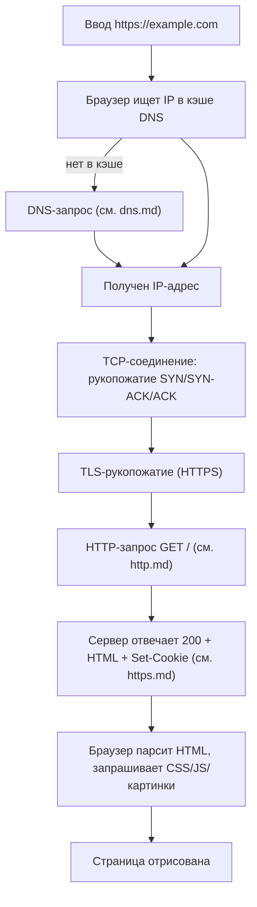
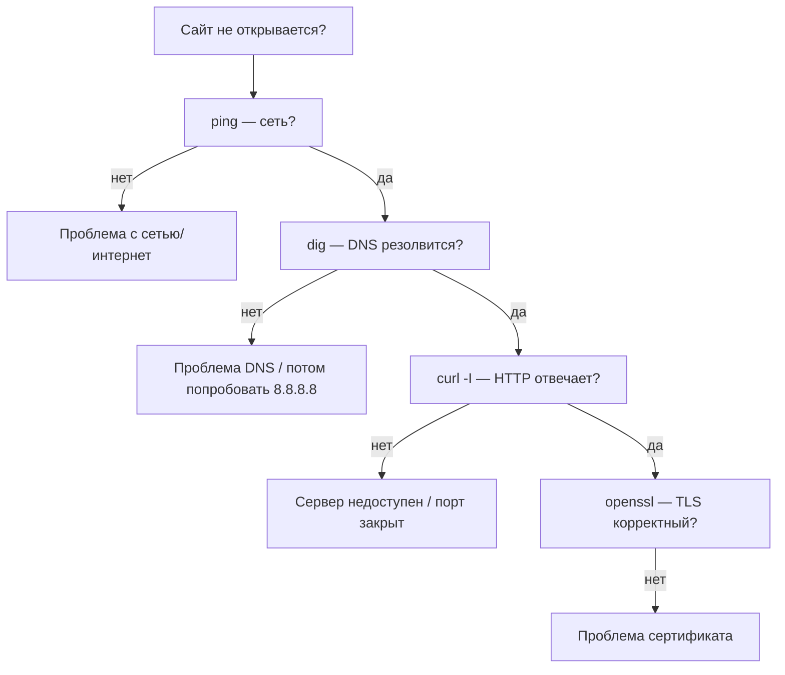

# Раздел 13 — Практика, инструменты и итоговый контроль

## В этом разделе

1. [Полный путь запроса к сайту](#1-полный-путь-запроса-к-сайту)
2. [Инструменты диагностики](#2-инструменты-диагностики)
3. [Работа с DevTools (Network)](#3-работа-с-devtools-network)
4. [Разбор частых проблем](#4-разбор-частых-проблем)
5. [Практические задания](#5-практические-задания)
6. [Итоговая самопроверка](#6-итоговая-самопроверка)

---

## 1. Полный путь запроса к сайту

Соберём всё вместе. Что происходит, когда вы вводите `https://example.com` в браузере?



Кратко: **DNS** (URL→IP) → **TCP** handshake → **TLS** handshake (HTTPS) → **HTTP** запрос/ответ → браузер строит страницу.

---

## 2. Инструменты диагностики

| Инструмент | Что делает | Пример |
|------------|-----------|--------|
| `ping` | Проверка доступности хоста (ICMP) | `ping 8.8.8.8` |
| `curl` | Выполнение HTTP-запросов из командной строки | `curl -v https://ya.ru` |
| `dig` / `nslookup` | DNS-запросы | `dig example.com A` |
| `openssl s_client` | Проверка TLS-сертификата | `openssl s_client -connect example.com:443` |
| `ss` / `netstat` | Просмотр портов/соединений | `ss -tulpn` |
| `traceroute` | Путь пакета до хоста | `traceroute example.com` |
| DevTools | Анализ HTTP в браузере | F12 → Network |

### curl — важнейший инструмент разработчика

```bash
curl -v https://example.com          # подробно (заголовки + тело)
curl -I https://example.com          # только заголовки (HEAD)
curl -X POST https://api.example.com/users -H "Content-Type: application/json" -d '{"name":"Иван"}'
curl -X DELETE https://api.example.com/users/1
curl -b "session=abc" https://example.com/profile   # отправить cookie
curl -H "Authorization: Bearer TOKEN" https://api.example.com/me
```

### Диагностика по шагам

1. **`ping`** — есть ли сеть до хоста на уровне IP.
2. **`dig`** — корректно ли резолвится DNS.
3. **`curl -I`** — отвечает ли сервер по HTTP и какие статусы.
4. **`openssl`** — корректность TLS.

Так вы локализуете, где проблема: DNS / сеть / TLS / приложение.

---

## 3. Работа с DevTools (Network)

Вкладка **Network** — главный инструмент для анализа HTTP.

Что там видно:

| Колонка | Что показывает |
|---------|----------------|
| Name | Имя ресурса / URL |
| Status | Статус-код (200, 304, 404...) |
| Type | Тип (document, script, stylesheet, image...) |
| Size | Размер / из кэша |
| Time | Время загрузки |
| Waterfall | Тайминги (DNS, Connect, TLS, Wait, Receive) |

### Tabbing: полный анализ запроса
Клик на запрос → вкладки:
- **Headers** — метод, URL, статус, все заголовки.
- **Payload** — тело/параметры запроса.
- **Preview / Response** — тело ответа.
- **Timing** — сколько заняли этапы (DNS, TCP, TLS и т.д.)

### Практические приёмы
- Фильтры по типу (XHR, JS, CSS, Img).
- Клик правой кнопкой → **Copy as cURL** — воспроизвести запрос в терминале.
- **Disable cache** — при разработке.

---

## 4. Разбор частых проблем

### Диагностика «сайт не открывается»



### Типичные ошибки и причины

| Симптом | Вероятная причина | Проверка |
|---------|-------------------|----------|
| `Could not resolve host` | Не резолвится DNS | `dig`, `nslookup` |
| `Connection refused` | Порт закрыт / служба не запущена | `ss -tulpn`, `curl` |
| `SSL certificate error` | Недоверенный/просроченный сертификат | `openssl s_client` |
| `408/504 Timeout` | Сервер долго не отвечает | тайминги + логи сервера |
| `403 Forbidden` | Нет прав | заголовки, аутентификация |
| `404` | Неверный URL | проверьте путь |
| `CORS error` | Нет заголовка CORS | заголовки ответа |

---

## 5. Практические задания

### Задание 1. Исследуйте свой любимый сайт (DevTools)
1. Откройте Network и обновите страницу.
2. Найдите документ (первый запрос) — метод, статус, `Content-Type`.
3. Определите, какие запросы вернули `304` (из кэша).
4. Найдите статусы `4xx`/`5xx` — если есть, объясните причину.
5. Посмотрите Timing: сколько занял DNS, TCP, TLS.

### Задание 2. Работа с DNS
```bash
dig ya.ru A
dig ya.ru MX
dig -x 8.8.8.8
nslookup google.com
```
Объясните каждый вывод.

### Задание 3. HTTP через curl
```bash
curl -I https://example.com
curl -v https://example.com | head -50
```
Опишите метод, версию, статус и ключевые заголовки.

### Задание 4. Проверка TLS
```bash
openssl s_client -connect example.com:443 -servername example.com -brief
```
Обратите внимание на версию TLS и выбранный шифр.

### Задание 5. Моделирование полного пути
Вручную (на бумаге или mermaid) пройдите путь от ввода URL до отображения страницы, подписав каждый протокол и уровень.

---

## 6. Итоговая самопроверка

Ответьте на вопросы (письменно, без подглядывания).

### Базовый уровень
1. Что такое протокол?
2. Сколько уровней в модели TCP/IP и какие?
3. Чем TCP отличается от UDP?
4. Что такое IP-адрес и порт? Что такое сокет?
5. Зачем нужен DNS? Какие записи A, AAAA, CNAME?
6. Что такое TTL и зачем кэширование DNS?
7. Назовите 4 основных метода HTTP и их назначение.
8. Что означает код 200, 301, 404, 500?
9. Для чего заголовки `Content-Type`, `Set-Cookie`, `Cache-Control`?
10. Чем HTTPS отличается от HTTP?

### Продвинутый уровень
11. Опишите три этапа TCP handshake.
12. Почему статистика: HTTP/2 быстрее HTTP/1.1?
13. Как работает ETag и условный запрос (304)?
14. Зачем атрибуты `HttpOnly` и `Secure` у cookie?
15. Что такое CORS и кто настраивает заголовки?
16. Как сочетаются асимметричное и симметричное шифрование в TLS?
17. Что такое центр сертификации и самоподписанный сертификат?
18. Зачем `SameSite` cookie? Какую атаку он блокирует?
19. Что такое DoH/DoT и от чего защищают?
20. Опишите весь путь от ввода URL до загрузки страницы.

> 💡 Любые сложности — вернитесь к соответствующему файлу: [основы](networking.md) · [TCP/IP](tcp-ip.md) · [DNS](dns.md) · [HTTP](http.md) · [безопасность](https.md).

---

## Что дальше?

После этого курса вы понимаете, как «под капотом» работает веб: адресация, доставка, домены, протоколы и безопасность. Это прочная база для:

- **Веб-разработки** (фронтенд/бэкенд) — понимание HTTP API, REST.
- **DevOps / администрирования** — настройка DNS, HTTPS, прокси.
- **Безопасности** — осознание угроз и способов защиты.

**Вернуться к оглавлению:** [index.md](index.md)

*Готово! Вы прошли путь от «как работает интернет» до HTTPS-рукопожатия. 🎉*
