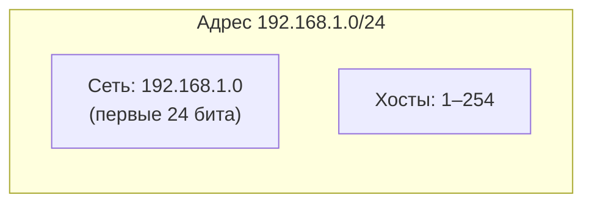
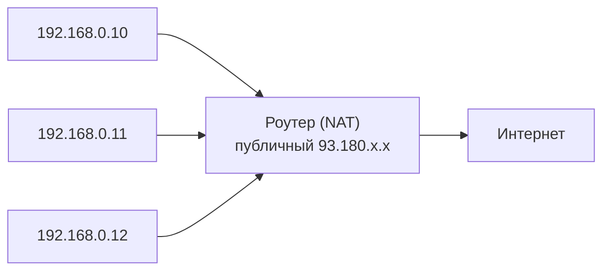
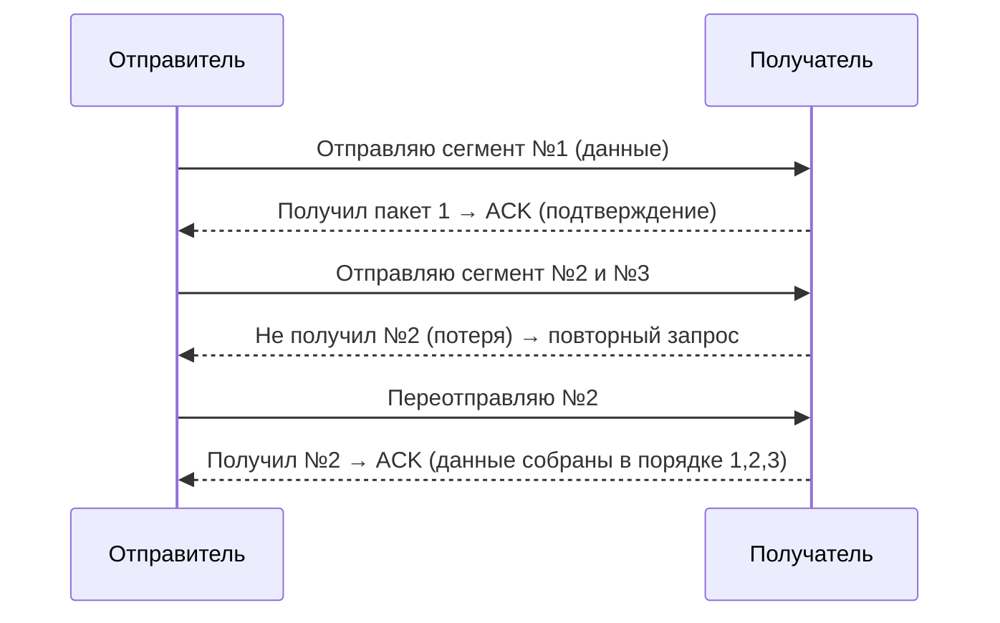
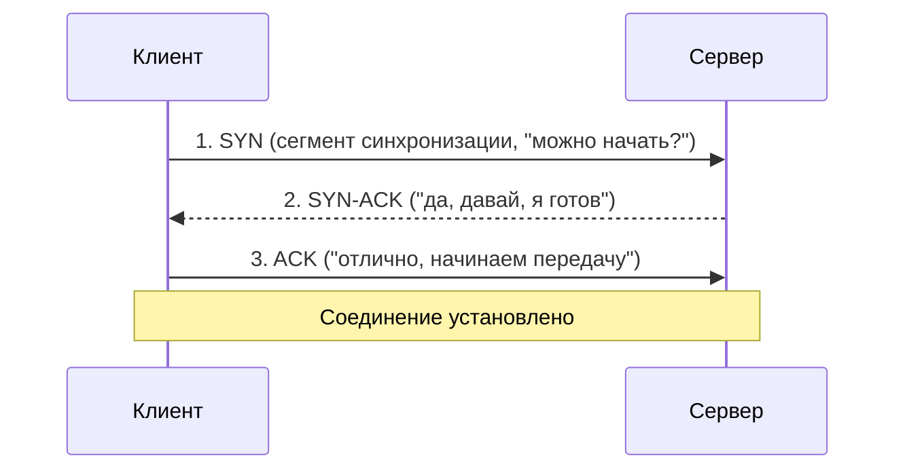
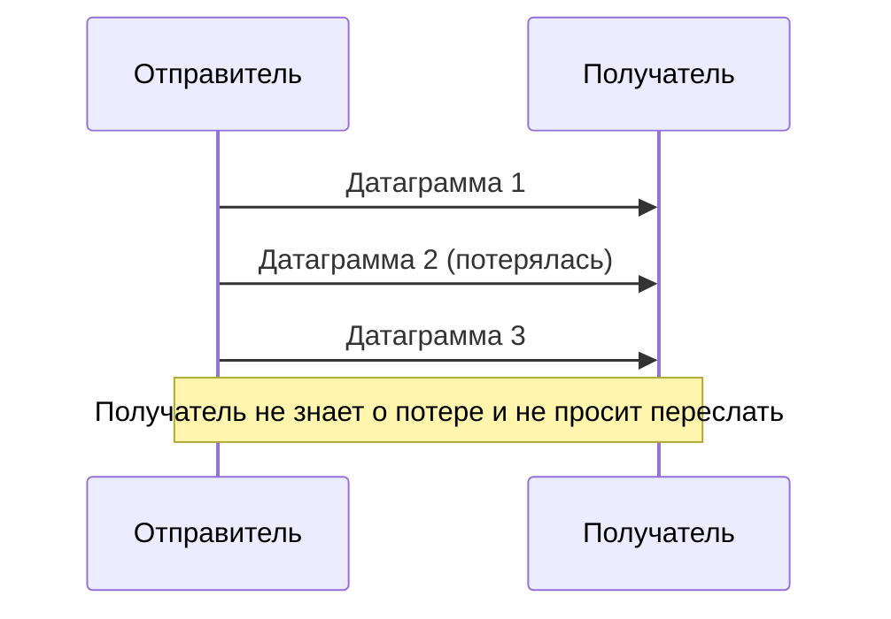

# Разделы 3–6 — IP, TCP, UDP, порты

## В этом разделе

1. [IP-адресация](#1-ip-адресация)
2. [IPv6: почему он понадобился](#2-ipv6-почему-он-понадобился)
3. [Публичные и приватные IP, NAT](#3-публичные-и-приватные-ip-nat)
4. [TCP: надёжная доставка](#4-tcp-надёжная-доставка)
5. [TCP: трёхстороннее рукопожатие](#5-tcp-трёхстороннее-рукопожатие)
6. [TCP: управление потоком](#6-tcp-управление-потоком)
7. [UDP: быстрая доставка](#7-udp-быстрая-доставка)
8. [TCP vs UDP: сравнение](#8-tcp-vs-udp-сравнение)
9. [Порты и сокеты](#9-порты-и-сокеты)
10. [Практика: разбор типичных ошибок](#10-практика-разбор-типичных-ошибок)
11. [Упражнения](#11-упражнения)

---

## 1. IP-адресация

**IP-адрес** — уникальный числовой адрес устройства в сети. По нему данные находят нужный компьютер.

### 1.1. IPv4

IPv4 — 32-битный адрес, записывается как 4 числа от 0 до 255, разделённых точками:

```
192.168.1.1
8.8.8.8
172.217.16.14  (google.com)
```

Диапазон одного октета: 0–255 (2^8 = 256 значений). Всего адресов IPv4 — около 4,3 миллиардов (2^32). Для современного мира этого **стало мало**.

### 1.2. IPv6

IPv6 — 128-битный адрес (2^128 = колоссально много). Записывается 8 группами по 4 шестнадцатеричные цифры:

```
2001:0db8:85a3:0000:0000:8a2e:0370:7334
```

Сокращения: ведущие нули группы можно убирать, а подряд идущие группы нулей — заменять на `::`:

```
2001:db8::8a2e:370:7334
```

IPv6 де-факто решает проблему нехватки адресов.

---

## 2. IP-адресация: подсети и CIDR

IP-адрес логически делится на **номер сети** и **номер хоста**. Маска (или префикс CIDR `/<число>`) отделяет одно от другого.

- `192.168.1.0/24` — префикс `/24` означает, что первые 24 бита — это сеть, остальные 8 — хосты (до 254 устройств).
- `/8` — очень большая сеть (16 млн адресов).
- `/30` — крошечная сеть (2 адреса для связи).



Для практики веб-разработки детальные подсети редко нужны, но полезно понимать смысл `10.0.0.0/8`, `172.16.0.0/12`, `192.168.0.0/16` — это **приватные** диапазоны.

---

## 3. Публичные и приватные IP, NAT

### Публичные IP
Глобально маршрутизируемые адреса (уникальны в интернете). Их мало и они «дорогие».

### Приватные IP
Внутренние адреса локальных сетей (не маршрутизируются в интернете). Стандартные диапазоны:
- `10.0.0.0 – 10.255.255.255` (10.0.0.0/8)
- `172.16.0.0 – 172.31.255.255` (172.16.0.0/12)
- `192.168.0.0 – 192.168.255.255` (192.168.0.0/16)

Домашние роутеры обычно раздают устройствам адреса вида `192.168.0.x`.

### NAT (Network Address Translation)
Раз все имеют приватные адреса, но в интернете нужен **один** публичный — роутер использует **NAT**: превращает приватный адрес+порт в публичный и обратно.



> Важно для разработчика: **localhost / 127.0.0.1** — это «петля» (loopback), адрес самого устройства. Обращение к своему компьютеру.

---

## 4. TCP: надёжная доставка

**TCP** (Transmission Control Protocol) — транспортный протокол, гарантирующий **надёжную доставку** данных в правильном порядке.

Что даёт TCP:
- **Упорядочивание** пакетов (нумерация).
- **Подтверждение** получения (ACK).
- **Переотправка** потерянных пакетов.
- **Контроль потока** (не перегружать получателя).
- **Контроль перегрузки** (не перегружать сеть).

Процесс работы TCP наглядно:



---

## 5. TCP: трёхстороннее рукопожатие

Перед обменом данными TCP-соединение **устанавливается** трёхшаговым «рукопожатием» (three-way handshake). Это как заранее договориться о разговоре.



Шаги:
1. **SYN** — клиент просит установить соединение.
2. **SYN-ACK** — сервер соглашается и синхронизируется.
3. **ACK** — клиент подтверждает соглашение. Соединение готово.

Только после этого начинаются реальные данные (например, HTTP-запрос). Именно поэтому первый запрос к новому серверу занимает чуть больше времени — нужно сначала «поздороваться» по TCP.

> ⚠️ HTTP/2 и HTTP/3 пытаются **переиспользовать** соединения (keep-alive, мультиплексирование), чтобы не повторять рукопожатие каждый раз.

---

## 6. TCP: управление потоком

### 6.1. Скользящее окно

Отправитель не «вываливает» всё сразу, а отправляет «окно» пакетов, ожидая подтверждения. Размер окна может меняться динамически.

### 6.2. Контроль перегрузки (congestion control)

Если сеть перегружена, TCP снижает скорость, реагируя на потери пакетов — алгоритм **slow start** (медленный старт) и **AIMD** (аддитивное увеличение / мультипликативное уменьшение).

Это гарантирует, что поток не «задушит» сеть.

---

## 7. UDP: быстрая доставка

**UDP** (User Datagram Protocol) — транспортный протокол **без установки соединения** и без гарантий доставки. «Огненный и забыл».

Особенности UDP:
- Нет рукопожатия, нет подтверждений, нет переотправки.
- Пакеты **могут прийти не по порядку или потеряться**.
- Зато очень **быстро** и с маленькой задержкой.
- Нет контроля потока.



---

## 8. TCP vs UDP: сравнение

| Характеристика | TCP | UDP |
|----------------|-----|-----|
| Соединение | Устанавливает (рукопожатие) | Не устанавливает |
| Надёжность | Гарантирует доставку и порядок | Не гарантирует |
| Переотправка | Да | Нет |
| Контроль потока | Да | Нет |
| Скорость/задержка | Выше задержка | Минимальная задержка |
| Применение | HTTP/HTTPS, почта, файлы | Видеозвонки, стримы, игры, DNS |

**Когда что:**

| Задача | Протокол | Почему |
|--------|----------|--------|
| Загрузка веб-страницы | TCP | Важна целостность |
| Отправка email | TCP | Нельзя потерять письмо |
| Передача файлов (FTP) | TCP | Важна полнота |
| Видеозвонок | UDP | Важна скорость, потеря кадра не страшна |
| Онлайн-игры | UDP | Низкая задержка важнее идеальной точности |
| DNS-запросы | UDP (для простых) | Короткий и быстрый вопрос-ответ |

---

## 9. Порты и сокеты

### 9.1. Что такое порт

IP-адрес находит **устройство**, но на одном устройстве работает много программ (веб-сервер, почта, SSH). **Порт** (0–65535) определяет, **какому приложению** передать данные.

Порт — как «номер квартиры» на IP-«доме».

### 9.2. Известные (well-known) порты

| Порт | Протокол | Назначение |
|------|----------|------------|
| 20/21 | FTP | Передача файлов |
| 22 | SSH | Удалённый доступ (безопасный) |
| 25 | SMTP | Отправка почты |
| 53 | DNS | Система доменных имён |
| 80 | HTTP | Обычный веб |
| 443 | HTTPS | Безопасный веб |
| 3306 | MySQL | База данных |
| 5432 | PostgreSQL | База данных |

Порты **< 1024** — привилегированные (требуют прав администратора).

### 9.3. Сокет

**Сокет** — пара «IP-адрес : порт», уникально идентифицирующая конечную точку соединения.

```
Клиент:  192.168.0.10:53124  →  Сервер: 93.180.x.x:443
```

Клиентские порты часто случайные (в диапазоне 49152–65535), серверные — известные (80, 443).

### 9.4. Просмотр соединений

На Linux:

```bash
ss -tulpn        # слушающие порты
ss -tn           # активные TCP-соединения
netstat -tulpn   # классический вариант
```

На Windows: `netstat -an`.

---

## 10. Практика: разбор типичных ошибок

| Ошибка/путаница | Правильное понимание |
|------------------|----------------------|
| «IP-адрес определяет приложение» | IP находит устройство, порт — приложение |
| «TCP всегда лучше UDP» | Нет: для видео/игр TCP создаст паузы из-за переотправки |
| «Можно открыть сайт без DNS, введя IP» | Да, возможно, но неудобно; и сервер должен слушать этот IP |
| «Свой IP вижу в админке роутера, значит он публичный» | Скорее всего это приватный 192.168.x.x, публичный — у роутера |
| «localhost — это какой-то внешний адрес» | localhost = 127.0.0.1 = сам компьютер |
| «Порт 80/443 только для HTTPS/HTTP» | Это «стандарты по умолчанию», но можно настроить иначе |

### Диагностика (полезные команды)

```bash
ping 8.8.8.8        # есть ли сеть/интернет (ICMP)
curl -v https://ya.ru   # подробный HTTP-запрос
ss -tulpn           # какие порты открыты
```

---

## 11. Упражнения

1. Определите тип адреса: публичный или приватный — `10.0.0.5`, `8.8.8.8`, `192.168.1.1`, `172.217.16.14`.
2. Нарисуйте Mermaid-диаграмму трёхстороннего рукопожатия TCP.
3. Опишите, какой протокол (TCP/UDP) вы бы выбрали для: онлайн-2D-игры, скачивания документа, стримингового видео, банковской транзакции. Обоснуйте.
4. Выполните `ss -tulpn` и найдите, какие порты открыты на вашей машине.
5. Запишите сокет сервера для сайта, который «слушает» по HTTPS на IP 5.6.7.8.

---

**Дальше:** [Раздел 7–8 — DNS →](dns.md)
